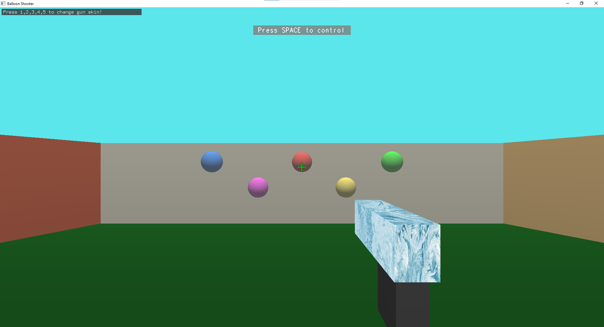
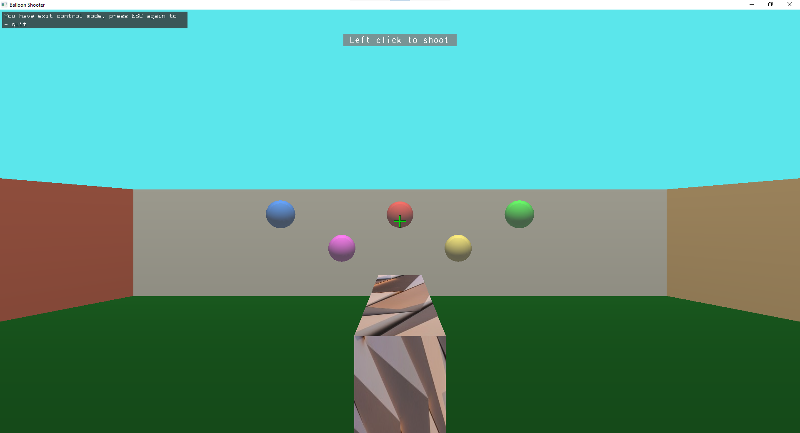
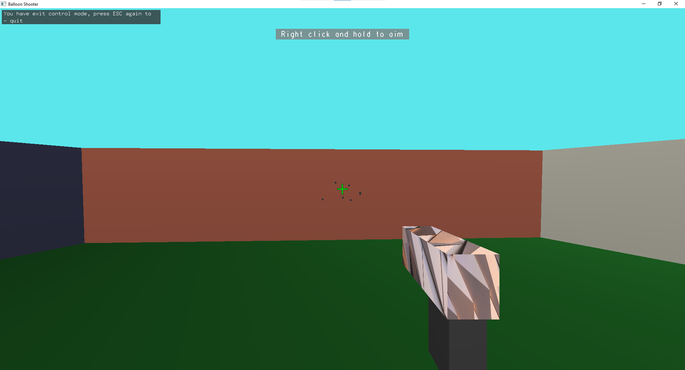
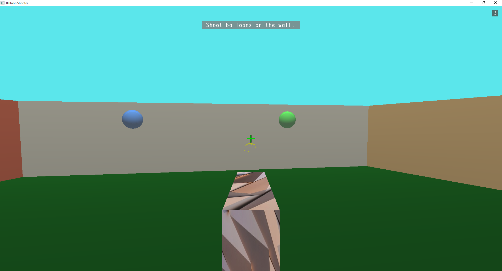
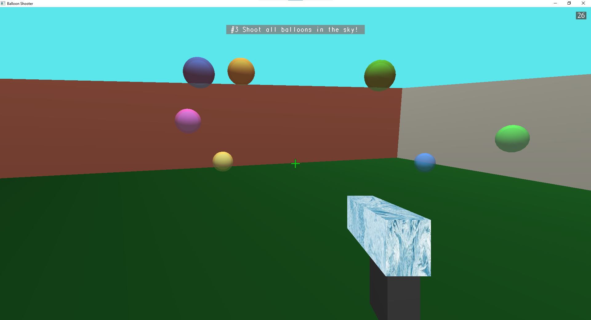
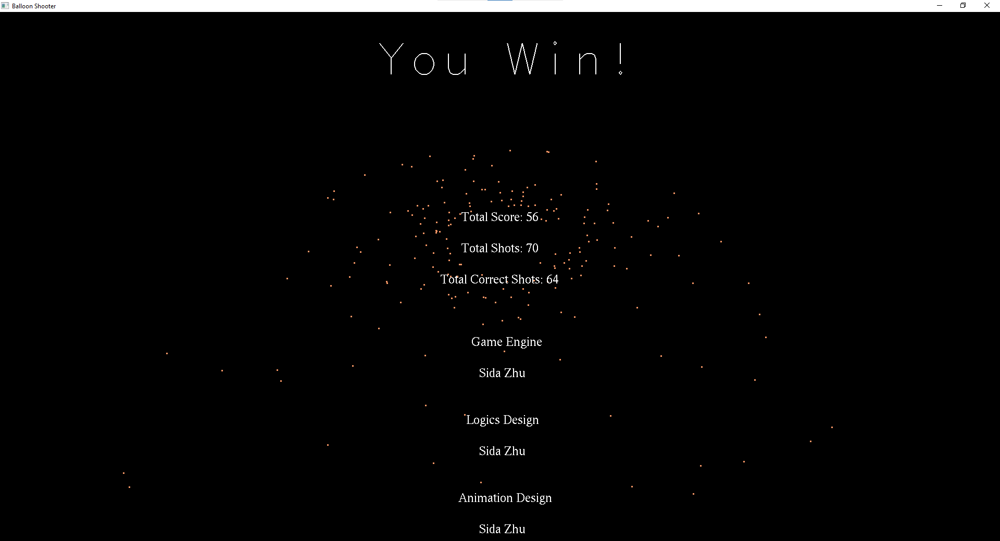
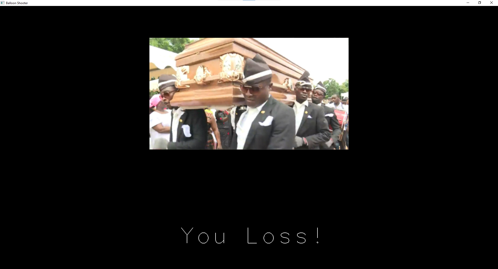

# Balloons
Balloon Shooting Game (CIS425 Final Project)  
Use `glut` and outdated OpenGL because of requirements  

------

### Build Guide

Windows (MSVC)  
```powershell
mkdir build
cd build
cmake ..
cmake --build . --config Release
```

Other (Unix)  
```sh
mkdir build
cd build
cmake ..
make
```

Then go into the auto generated folder `bin` and run the executable `balloon`  

### Build Requirements  

* x64 machine  
* compilers  
  * MacOS & Linux (GCC supporting C++11)  
  * Windows (MSVC supporting C++11)  
* cmake (>= 3.15)  

------

### Dependencies  
* freeglut ([3.2.1](http://freeglut.sourceforge.net/index.php#download))  
* glm ([0.9.9.8](https://github.com/g-truc/glm/releases/tag/0.9.9.8))  
* irrKlang ([1.6.0](https://www.ambiera.com/irrklang/downloads.html))  
* stb_image ([2.26](https://github.com/nothings/stb))  
* tinygltf ([2.5.0](https://github.com/syoyo/tinygltf/releases/tag/v2.5.0), included but not used in final game)  

------

### New Features Explored

* textures  
* ray casting  
* particle system  
* audio  
* transparency  


------

### Gallery  

First View  
  

Various Gun Skins  


Bullets On The Wall  


Fireworks When Balloons Shot  


Boucing Balloons  


You Win! (fireworks at the background)  


You Loss!  
